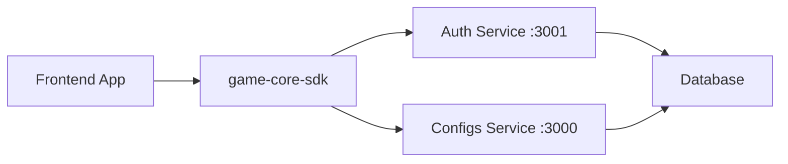

# Quick Start Guide

## 1. Build the SDK

```bash
cd /home/pc/Gambling/game-core-sdk
npm install
npm run build
```

## 2. Install in Frontend

```bash
cd /home/pc/Gambling/game-core-sdk-frontend
npm install ../game-core-sdk
```

## 3. Basic Usage

```javascript
import { coreSDK } from 'game-sdk';

async function initAndTest() {
  // Initialize with separate service URLs
  await coreSDK.init({
    app: 'ai-games-platform',
    version: '1.0.0',
    baseUrl: 'http://localhost:3000',    // Configs service
    authUrl: 'http://localhost:3001',     // Auth service
    skipAuth: true                         // Skip guest auth for manual login
  });

  console.log('SDK initialized!');

  // Test health endpoint
  const health = await coreSDK.health.check();
  console.log('Health:', health);

  // Register new user
  try {
    const user = await coreSDK.register({
      email: 'player@example.com',
      username: 'player1',
      password: 'SecurePassword123!'
    });
    console.log('Registered:', user);
  } catch (error) {
    console.log('User may already exist:', error.message);
  }

  // Login
  const { accessToken, user } = await coreSDK.login({
    email: 'player@example.com',
    password: 'SecurePassword123!'
  });
  console.log('Logged in as:', user.username);

  // Initialize config (now authenticated)
  const config = await coreSDK.configs.init({
    v: '1.0.0',
    scopes: ['gameplay', 'ui']
  });
  console.log('Config:', config);

  // Get active A/B tests
  const tests = await coreSDK.abTests.getActive();
  console.log('Active tests:', tests);
}

initAndTest().catch(console.error);
```

## 4. Available Clients

All clients are accessible via `coreSDK`:

```javascript
coreSDK.auth          // Authentication (login, register, logout, getMe, refresh)
coreSDK.configs       // Configuration management
coreSDK.abTests       // A/B testing
coreSDK.remoteConfigs // Remote configurations
coreSDK.segments      // User segments
coreSDK.users         // User management
coreSDK.health        // Health checks
```

## 5. Convenience Methods on CoreSDK

```javascript
// Direct methods on coreSDK instance
await coreSDK.login({ email, password });    // Login and store token
await coreSDK.register({ email, username, password }); // Register user
await coreSDK.logout();                       // Logout and clear token
```

## 6. Start Backend Services

Make sure the backend services are running:

```bash
# Auth service (port 3001)
cd /home/pc/Gambling/ai-games-platform/auth
npm run start:dev

# Configs service (port 3000)
cd /home/pc/Gambling/ai-games-platform/configs
npm run start:dev
```

API endpoints:
- Auth API: `http://localhost:3001/v1/auth/*`
- Configs API: `http://localhost:3000/v1/configs/*`
- Swagger docs: `http://localhost:3000/api/docs`

## 7. Start Frontend

```bash
cd /home/pc/Gambling/game-core-sdk-frontend
npm start
```

Frontend will be available at: `http://localhost:5000`

## Complete Flow



## SDK Files

- [src/CoreSDK.ts](src/CoreSDK.ts) - Main SDK class with auth methods
- [src/types.ts](src/types.ts) - TypeScript types
- [src/api-types.ts](src/api-types.ts) - API request/response types
- [src/clients/AuthApiClient.ts](src/clients/AuthApiClient.ts) - Auth client
- [src/clients/ConfigsApiClient.ts](src/clients/ConfigsApiClient.ts) - Configs client
- [src/clients/AbTestsApiClient.ts](src/clients/AbTestsApiClient.ts) - A/B Tests client
- [src/clients/RemoteConfigsApiClient.ts](src/clients/RemoteConfigsApiClient.ts) - Remote configs
- [src/clients/SegmentsApiClient.ts](src/clients/SegmentsApiClient.ts) - Segments client
- [src/clients/UsersApiClient.ts](src/clients/UsersApiClient.ts) - Users client
- [src/clients/HealthApiClient.ts](src/clients/HealthApiClient.ts) - Health client
- [src/config.ts](src/config.ts) - SDK configuration (baseUrl, authUrl)
- [src/index.ts](src/index.ts) - Exports

## Documentation

- [API_USAGE.md](API_USAGE.md) - Complete API reference
- [FRONTEND_INTEGRATION.md](FRONTEND_INTEGRATION.md) - React integration

## Example: Authentication Flow

```javascript
import { coreSDK } from 'game-sdk';

// Initialize SDK
await coreSDK.init({
  app: 'my-game',
  version: '1.0.0',
  baseUrl: 'http://localhost:3000',
  authUrl: 'http://localhost:3001',
  skipAuth: true
});

// Register
const user = await coreSDK.register({
  email: 'user@example.com',
  username: 'player1',
  password: 'Password123!'
});
console.log('Registered:', user);

// Login
const { accessToken, refreshToken, user: loggedInUser } = await coreSDK.login({
  email: 'user@example.com',
  password: 'Password123!'
});
console.log('Token:', accessToken);

// Token is automatically stored and used for API calls
const config = await coreSDK.configs.init({ v: '1.0.0' });

// Logout
await coreSDK.logout();
```

## Example: Error Handling

```javascript
try {
  await coreSDK.register({
    email: 'bad-email',
    username: 'ab',  // too short
    password: '123'  // too weak
  });
} catch (error) {
  // Validation errors are joined:
  // "email must be an email, username must be at least 3 characters"
  console.error(error.message);
}
```

## UMD Build (Browser)

```html
<!-- Load SDK via script tag -->
<script src="/game-sdk.umd.js"></script>
<script>
  const sdk = window.coreSDK.coreSDK;
  sdk.init({
    app: 'my-game',
    baseUrl: 'http://localhost:3000',
    authUrl: 'http://localhost:3001'
  }).then(() => {
    console.log('SDK ready');
  });
</script>
```

---

**Last Updated**: December 2025
**Version**: 1.0.1
